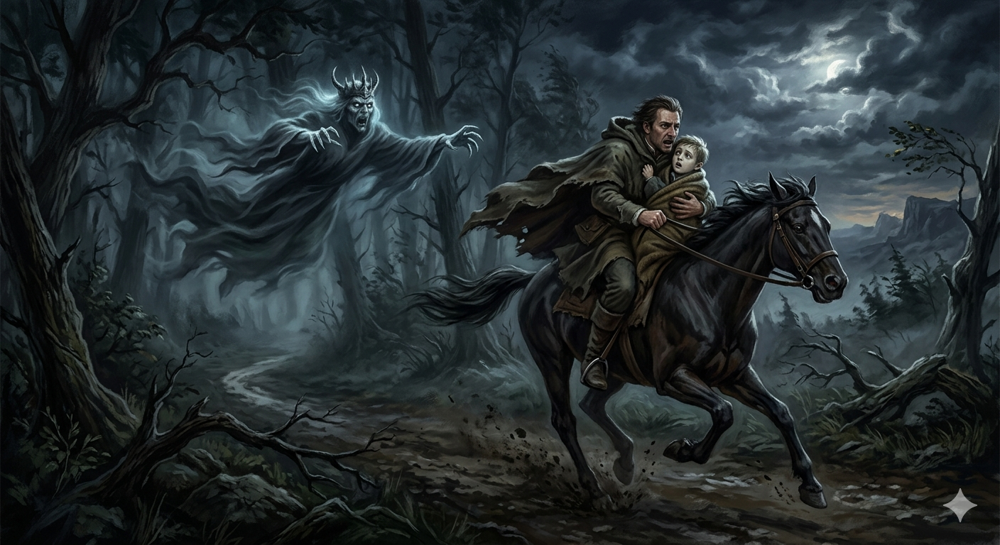

# The Elf King

[The art song 'The Elf King](https://youtube.com/watch?v=cDyadF3Zc6g&si=u0TrbqNJfnQUbzb6)was composed by Schubert, who was deeply inspired by Goethe's poem of the same name, 'Erlkönig' (The Elf King). Schubert was born on January 31, 1797. The lyrics of this art song tell the story of a sick son who begins to see the Erlkönig, while his father tries to escape to protect him, but ultimately, the son is captured by the Erlkönig and dies. In this solo piece, the roles are divided into the cunning voice of the Erlkönig, the father rushing back home, the terrified son, and a narrator. The Erlkönig's voice begins in B-flat major (the relative major), shifts to C major for the second part, and changes to D-flat major—the Neapolitan chord of C minor—for the third part. As the pitch gradually rises, it heightens the tension of being pursued by the Erlkönig, who serves as an anthropomorphism of the illness, and sends 'pain' to listeners. In relation to this, referencing [how music in other works expresses tension](ha-yubin.md) would also be informative. In the song's lyrics, the child's high fever is depicted as them hallucinating the Erlking, who attempts to entice the child away. This closely resembles Matthias Claudius's "Death and the Maiden," where Death similarly tempts a young girl. Also, I recommend you to check out [a piece of writing about another work that uses metaphors](kim-chaeeun.md). Unlike the child, the father cannot see the Erlkönig and desperately flees to save him, but the story concludes with the child's death, seemingly consumed by the illness or the Erlkönig before receiving any treatment. Regarding this narrative, it would be even more beneficial to read [an article dealing with a different genre of music](choi-yejin.md) I wish for [Joe Hisaishi's 'Summer'](https://youtu.be/l0GN40EL1VU?si=CKr3E-utsIzkRoGv) to be played at my funeral. This is because Summer is a magical piece where the brightness of D major, the bouncy syncopated rhythms, and the sun-drenched instrumentation come together to intuitively infuse our minds with the vibrant vitality of summer. So, the attendees may recall my desire to live a life as bright and radiant as a lively summer through their experience of hearing this music.Connecting this to the HYQ portfolio, just as funeral attendees are reminded of 'the me who always wanted to live life as bright and radiant as a vibrant summer' through this song, the listening experiences and memories tied to specific music become core elements that prove and construct the 'very essence of my being' to others even after death. If AI learns data from music that provides catharsis by vividly expressing the pain of illness—like 'Erlkönig' (The Elf King)—alongside music that evokes radiant memories of life like 'Summer' (such as key modulations, lyrics, and listening contexts), I believe it could maximize therapeutic effects by generating personalized, real-time 'empathic music' or 'memory-evoking music' tailored to the specific type of psychological distress a patient is experiencing.

# 마왕

[가곡'마왕'](https://youtube.com/watch?v=cDyadF3Zc6g&si=u0TrbqNJfnQUbzb6)은 슈베르트가 동명의 시 '마왕'에서 감명을 받아 작곡하였다. 슈베르트는 1797년 1월 31일 출생하였다.이 가곡의 가사는 병에 걸린 아들이 마왕을 보게 되고, 아버지는 그런 아들을 지키려 도망치지만 결국 아들이 마왕에 잡혀 죽게 되는 내용이다. 이 가곡은 솔로로 교활한 마왕이 말하는 장면, 집으로 서둘러 돌아오는 아버지, 공포에 떠는 아들, 그리고 해설자로 역이 나뉜다. 마왕의 목소리 부분은 처음은 나란한 조 내림 나장조, 두 번째는 다장조, 세 번째는 다단조의 나폴리조인 내림 라장조로 부르다가, 서서히 음이 올라가며 질병의 의인화인 마왕이 쫓아오는 상황의 긴장감을 높이고, 청자에게 고통을 전달한다. 이와 관련해서는 [다른 작품의 음악이 긴장감을 표현하는 방식](ha-yubin.md)도 참고하면 유익할 것이다. 가곡의 가사에서는 아이의 고열 증상을 아이가 마왕의 환상을 보는 것으로 표현하며, 마왕은 아이를 데려가려고 유혹한다. 이는 마티아스 클라우디우스의 '죽음과 소녀'에서 죽음이 소녀를 유혹하는 모습과 비슷하다. 더불어, [은유를 사용한 다른 작품에 대한 글](kim-chaeeun.md)도 참고해보길 권한다. 아이와 달리 아버지는 마왕을 보지 못하고, 아이를 위해 서둘러 도망치지만 결국 아이는 치료를 받기도 전에 질병 혹은 마왕에게 사로잡히고 만 듯 사망한 것으로 마무리된다. 이 내용과 관련해 가곡이 아닌 [다른 장르의 음악을 다룬 글](choi-yejin.md) 도 참고히면 더 유익할 것이다.내 장례식에는 [히사이시 조의 summer](https://youtu.be/l0GN40EL1VU?si=CKr3E-utsIzkRoGv)가 연주되면 좋겠다. 이유는 summer가 D장조의 화창함, 통통 튀는 당김음 리듬, 햇살을 닮은 악기 연주법이 결합하여 우리의 뇌에 '생동감 넘치는 여름의 생명력'을 직관적으로 주입하는 마법 같은 곡이기 때문이다. 그래서 장례식에 온 손님들이 이 노래를 통한 청취경험으로 늘 삶을 활기찬 여름처럼 밝고 찬란하게 살고자 하였던 나에 대해 떠올릴 수 있길 바라기 때문이다. 위 내용을 HYQ portfolio와 연결하면,장례식에 온 손님들이 이 노래를 통해 "늘 삶을 활기찬 여름처럼 밝고 찬란하게 살고자 했던 나"를 상기하게 하듯, 특정 음악에 얽힌 청취경험과 기억은 사후에도 '나라는 존재의 본질'을 타인에게 증명하고 구성하는 핵심 요소가 된다. '마왕'처럼 질병의 고통을 생생하게 표현하여 카타르시스를 주는 음악과, 'Summer'처럼 삶의 찬란한 기억을 불러오는 음악의 데이터(조성 변화, 가사, 청취 맥락 등)를 AI가 학습한다면, 환자가 겪는 정신적 고통의 종류에 따라 '공감형 음악'과 '기억 환기형 음악'을 개인 맞춤형으로 실시간 생성하여 치료 효과를 극대화할 수 있다고 생각한다.

