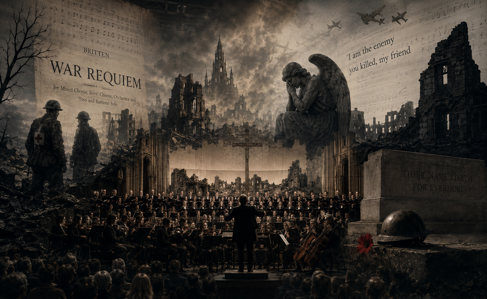

# War Requiem, Op.66

 Benjamin Britten’s *War Requiem* presents war as a “social disease” and reveals the experience of human suffering, that is, “illness,” through sound. As discussed in class, while medicine primarily focuses on disease as an objective biological condition, the medical humanities adopt a narrative medicine perspective that emphasizes the personal stories and lived experiences of those who suffer from illness. By juxtaposing the collective language of death found in the Latin Requiem with the individual voice of suffering expressed through Wilfred Owen’s war poetry, War Requiem musically illuminates the distinction between disease as an objective condition and illness as a subjective lived experience. [When listening to the music](https://youtu.be/pjV-j-wJ7LI?si=4rkkmPILNoXZg38b), the phrase “Dies irae, dies illa” expresses collective destruction and fear. Here, "Dies irae, dies illa" carries the meaning of "the day of wrath, that very day". The line “I am the enemy you killed, my friend” in the final movement breaks down the boundary between the enemy and the self, showing that the suffering of war cannot be reduced to an individual experience. Furthermore, as suggested by Elaine Scarry’s theory that pain is inherently difficult to verbalize, the dissonance and fragmented structure of this work do not explain suffering so much as allow listeners to experience it physically. If we connect this more specifically to musical expression, in the second movement, Dies Irae, the powerful entrance of the brass instruments and the relentlessly driving rhythmic patterns convey the overwhelming terror of a battlefield, impacting the audience almost physically and evoking the fear of a battlefield where shells may fall at any moment. Furthermore, the massive sonorities created by the chorus and orchestra sonically embody images of collective destruction, while the recurring tritone dissonance that permeates the work as a whole sustains a sense of chronic psychological anxiety and unresolved tension. This invites Pauline Oliveros’s concept of Deep Listening, which transcends mere hearing, and demands a new ethics of listening that compels audiences to confront, rather than ignore, the horrors of war. This anxiety and fear ultimately culminate in guilt and intrusive memories in the final movement, Libera me. In particular, the moment when the tenor and baritone sing “I am the enemy you killed, my friend” in a low and unstable melodic line goes beyond a simple recollection of the past, revealing, almost as a personal monologue, the survivor’s overwhelming guilt for having killed an enemy and survived. The musical expressions woven throughout the work are closely connected to the specific symptoms of PTSD experienced by patients. The brutal brass rhythms in the second movement evoke intrusive memories that suddenly resurface, while the dissonant tritone that permeates the piece reflects a state of chronic anxiety. Furthermore, the low and unstable melody in the final movement serves as an auditory representation of the survivor’s profound survivor’s guilt. Together, these musical elements provide a powerful sonic summary of the psychological trauma associated with PTSD. Although this passage seems to symbolize the possibility of human reconciliation between enemies, Britten refuses traditional religious redemption and harmonious resolution. This approach aligns with Theodor W. Adorno’s Aesthetics of Negativity and Edward Said’s notion of late style as dissonance and resistance. Accordingly, by deconstructing musical form and preserving unresolved tension, Britten completes a musical illness narrative that rejects the idea of complete reconciliation. In this regard, [referencing music from other works,(Elgar's "Nimrod" in the movie Dunkirk)](kim-minsun.md), would be insightful. In particular, both works share a common approach in that they do not attempt to forcibly heal or resolve the trauma of war and broken bodies.
 

# The Music I Hope Will Be Played at My Funeral

 On the other hand, these musical reflections on death and remembrance also lead me to contemplate my own life and final moments. If a funeral were ever held to bid me farewell, I would hope that [the second movement of Frédéric Chopin’s Piano Concerto No. 2](https://youtu.be/D2ue7nn4zhc?si=aApGVA_VYTr1PAnw) would be performed. It is not only one of my favorite pieces, but I also hope that, for the duration of its performance, it will provide a moment in which those I leave behind can think solely of me and remember me with affection. I also hope that they will allow themselves to grieve fully for my passing. As the music unfolds, I wish for them to miss me, shed their tears, and embrace their sorrow without restraint. Then, when the music ends and a new day begins, I hope they can carry a little less of that sadness and continue their lives with greater peace and strength. I sincerely hope that this piece will accompany them through that meaningful moment.

# Conclusion

 First, the analysis of Benjamin Britten’s War Requiem provides important implications for the future question: “If normality is a social construct, on what basis do we judge others, and to what extent should we critically examine the medical norms established by society?” In medicine, PTSD is often treated as an objective and measurable disease, defined primarily through diagnostic criteria. However, Britten represents the subjective experience of suffering—what is often referred to as illness—through musical devices such as dissonance and low, unstable melodic lines. In doing so, the work demonstrates how art can communicate dimensions of suffering that medical diagnosis alone cannot fully capture. It can also be interpreted as a form of resistance that challenges the biased perspectives of those who hold authority and power. Furthermore, the work rejects traditional notions of religious salvation and harmonious resolution, instead leaving unresolved tension. This encourages listeners to reflect on their own attitudes toward the suffering of others. In this sense, the piece symbolizes the dangers of both stigmatization, which reduces individuals to objects of pity and exclusion, and romanticization, which excessively glorifies their suffering. It ultimately highlights our ethical responsibility to avoid judging others’ pain through a singular and simplified perspective. Finally, my personal wish that Chopin’s Piano Concerto No. 2 be played at my future funeral, allowing those left behind to grieve fully before gradually letting go of their sorrow, can be connected to the ultimate goal of the HYQ portfolio: the practice of solidarity and hospitality. In particular, it reflects a similar attitude in that it embraces the pain of loss and death rather than attempting to resist or deny it.

# 전쟁 레퀴엠, 작품 번호 66

 벤자민 브리튼의 전쟁 레퀴엠은 전쟁을 하나의 ‘사회적 질병’으로 설정하고 그 속에서 인간이 겪는 고통의 경험, 즉 ‘질환 경험(illness)’을 소리로 드러낸다. 수업에서 다루어진 것처럼 의학은 객관적 사실로서의 ‘질병(disease)’을 중심으로 이해한다면, 의료인문학은 그 병을 겪는 개인의 서사와 경험에 주목하는 ‘서사의학(Narrative Medicine)‘적 관점을 취한다. 이 작품은 라틴어 레퀴엠의 집단적 죽음의 언어와 윌프레드 오웬의 전쟁 시라는 개인적 고통의 목소리를 병치함으로써 의학적 질병(disease)과 주관적 질환(illness) 사이의 대비를 음악적 구조로 선명하게 드러낸다. [음악을 들어보면](https://youtu.be/pjV-j-wJ7LI?si=4rkkmPILNoXZg38b), “Dies irae, dies illa”와 같은 구절이 집단적인 파괴와 공포를 드러낸다. 여기서 "Dies irae, dies illa"는 "진노의 날, 바로 그날" 이라는 뜻을 담고 있다. 마지막 악장에 나오는 “I am the enemy you killed, my friend”라는 시 구절은 적과 나의 경계를 허물며 전쟁 속 고통이 개인의 경험으로 환원될 수 없음을 보여준다. 또한 고통은 본질적으로 언어화되기 어렵다는 일레인 스캐리(Elaine Scarry)의 이론처럼 이 작품의 불협화음과 분열된 구조는 고통을 설명하기보다 듣는 이로 하여금 신체적으로 체험하게 만든다. 구체적으로 음악적 표현들과 엮어본다면, 제 2악장 Dies Irae에서는 금관악기의 강렬한 도입과 반복적으로 몰아치는 리듬을 통해 언제 포탄이 떨어질지 모르는 전쟁터의 압도적인 공포를 관객의 신체에 직접 타격하듯 전달한다. 또한 합창과 관현악의 거대한 음향은 집단적 파괴의 이미지를 청각적으로 형상하며, 곡 전반을 지배하는 '증 4도' 불협화음은 해결되지 않는 만성적인 심리적 불안과 긴장을 지속시킨다. 이는 폴린 올리버로스(Pauline Oliveros)가 제시한 단순한 ‘들음(Hearing)’을 넘어선 ‘깊은 청취(Deep Listening)’를 유도하며, 청자에게 전쟁의 참상을 외면하지 못하게 하는 ‘새로운 듣기의 윤리‘를 요구한다. 이러한 불안과 공포는 마지막 악장 Libera me에서 죄책감과 침습적 회상으로 수렴된다. 특히 테너와 바리톤이 낮고 불안정한 선율로 "I am the enemy you killed, my friend"를 노래하는 순간은, 단순한 과거 회상을 넘어 적을 죽이고 살아남았다는 생존자의 극심한 죄책감을 독백처럼 폭로한다. 이처럼 작품 전반에 배치된 음악적 표현들은 환자가 겪는 구체적인 PTSD 증상들과 긴밀히 연결되어 있다. 즉, 제2악장의 포악한 금관악기의 리듬은 불쑥 떠오르는 '침습적 기억'을, 곡을 지배하는 증4도 불협화음은 만성적인 '불안'의 상태를, 그리고 마지막 악장의 낮고 불안정한 선율은 살아남은 자의 치명적인 '생존자의 죄책감'을 청각적으로 요약한다. 비록 이 구절이 적과 적 사이의 인간적인 화해의 가능성을 상징하는 것처럼 보이지만, 브리튼은 전통적인 종교적 구원이나 조화로운 완성을 거부한다. 이는 테오도어 아도르노(Theodor W. Adorno)의 ‘부정성의 미학(Aesthetics of Negativity)’ 및 에드워드 사이드(Edward Said)의 ‘불화와 저항으로서의 말년의 양식’과 맥을 같이 한다. 이에 따라, 브리튼은 음악적 형식을 해체하고 해결되지 않는 긴장을 남겨둠으로써 완전한 화해를 거부하는 음악적 ‘질환 서사’를 완성한다. 이와 관련해서는 [다른 작품 속 음악(영화 덩케르트 속 엘가 '님로드')](kim-minsun.md)도 참조하면 도움이 될 것이다. 특히, 전쟁의 고통과 부서진 신체를 억지로 치유하거나 해결하기 위해 노력하지 않는다는 점이 공통적이다.
 

# 나의 장례식에서 연주되길 희망하는 음악

 한편, 이러한 죽음과 추모에 대한 음악적 단상은 나 개인의 삶과 마지막 순간에 대한 생각으로도 이어진다. 미래에 나를 떠나보내는 장례식이 마련된다면, [쇼팽(F. Chopin)의 피아노 협주곡 2번, 2악장](https://youtu.be/D2ue7nn4zhc?si=aApGVA_VYTr1PAnw)이 연주되기를 희망한다. 가장 좋아하는 작품인 것과 동시에 이 음악이 연주되는 그 시간만큼은, 남겨진 이들이 오롯이 나를 떠올리며 추모하는 시간으로 남았으면 한다. 또한 나를 위해 충분히 슬퍼해주었으면 하는 마음을 담았다. 음악이 흐르는 동안 마음껏 그리워하고 눈물도 흘린 뒤, 다음 날부터는 모두가 조금은 이 슬픔을 덜어내고 덜 힘들게 각자의 삶을 살아가길 바라는 마음이다. 이 작품이 그 시간을 꼭 함께해 줄 수 있기를 바란다.

# 결론

 먼저, 브리튼의 ‘전쟁 레퀴엠’ 분석은 ‘정상성이 사회적 구성물이라면 우리는 무엇을 근거로 타인을 판단하며, 사회가 만든 의학적 규범의 기준들을 우리는 얼마나 비판적으로 검토해야 하는가(Future Question)'라는 질문에 중요한 시사점을 보여준다. 의학에서는 PTSD를 단순히 수치화된 객관적 ‘질병(disease)'으로만 판단하려 하지만, 브리튼은 불협화음과 낮고 불안정한 선율이라는 음악적 장치를 통해 환자가 주체적으로 겪는 고통인 ’질환 경험(illness)'을 나타낸다. 이는 작품에서 의학에서 단순히 ‘진단’을 내림으로써 포착하지 못하는 환자의 고통을 예술이 어떻게 전달하는지 보여주고 있으며, 권력(권위)를 가진 주체들의 편향된 시선에 균열 내는 저항이라고도 볼 수 있다. 또한, 이 작품은 전통적인 종교적 구원이나 조화로운 완성을 거부하고 해결되지 않는 긴장을 남겨두는데, 이러한 점은 타인의 고통을 마주하는 우리의 태도를 반성하게 만든다. 이는 고통받는 이들을 무조건적으로 동정하며 소외시키는 ’낙인화‘나 그들의 비극을 과도하게 미화시키는 ’낭만화‘의 주의점을 상징하며, 우리 스스로의 단일화된 시선으로 타인의 고통을 판단하는 윤리적 책임을 이야기한다. 마지막으로, 미래의 내 장례식에서 쇼팽의 피아노 협주곡이 흐르기를 바라며 남겨진 이들이 충분히 슬퍼한 뒤 슬픔을 덜어내길 바라는 개인적 희망은, HYQ 포트폴리오의 최종 지향점인 ’연대와 환대의 실천적인 태도‘와 연관을 지을 수 있는데, 특히 죽음이라는 어떠한 상실의 고통을 저항하려고 하기보다는 받아들이기를 바란다는 점에서 유사한 태도를 지니고 있다.
