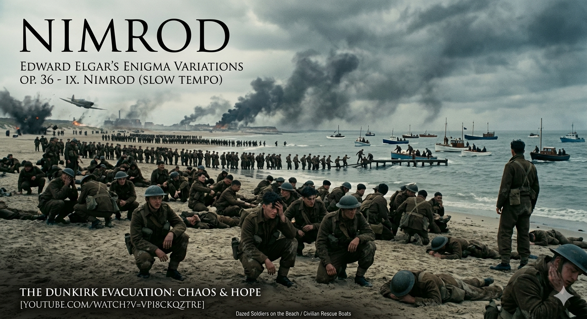

---
Title: Dunkirk
Year: 2017
Genre: film
Diseases: Mental illness including PTSD
ICD: F43.1
--- 

# Dunkirk

Edward Elgar’s Nimrod in the film Dunkirk (arranged by Hans Zimmer) represents a powerful aesthetic resistance against the modern medical and artistic authorities that have historically enforced bodily "normalcy and normativity". Just as 19th-century orthopedics attempted to conform the human body to an idealized technique through corrective devices like the chiroplast, traditional musical norms have similarly demanded perfection based on ableism and audism. However, the extremely elongated and distorted melody of Nimrod in the film rejects anatomical correction, instead bearing raw witness to the subjective suffering ("illness") of humans shattered by war. 

This heavy, dull sound induces a "phenomenology of vibration" perceived not just by audition but through the tactile senses of the entire body, liberating sound from being an exclusive domain of the non-disabled and connecting with the alternative sensory realm where Deaf individuals recreate music through bodily vibration. This distorted melody musically defines Tobin Siebers’ concept of "Disability Aesthetics," which embraces the unique beauty of bodies deemed "damaged" by traditional standards. Much like Glenn Gould, who established a distinct aesthetic of the broken body by playing Bach in his own peculiar posture, Nimrod in the film elevates the very imperfection of mutilated and fragmented bodies into a unique aesthetic identity. 

When these fragmented melodies finally achieve tonal resolution into a complete orchestral form in the film's latter half, it is not a regression to normative normalcy. Rather, it is the realization of what Rachel Kolb terms a "relational ontology". The moment isolated soldiers encounter civilian boats and respond to each other's suffering, the completed music transforms into a narrative medical medium that mediates human connection, refaming the suffering body not as a mere deficit, but as a vivid site of interconnected "situated knowledge". This database entry directly addresses Q2 of my HYQ Portfolio, providing a concrete auditory example of how the physical limitations and raw suffering of the human body create a unique aesthetic aura that statistical AI simulations can never truly replicate. 

Below is the youtube link and AI- generated image of Nimrod. 

[youtube video](https://www.youtube.com/watch?v=vPi8CkQZTRE)

# 덩케르크

영화 《덩케르크》 속 엘가의 《님로드》(한스 짐머 편곡)는 신체의 ‘정상성과 규범성’을 강제해 온 근대 의학 및 예술 권력에 대한 강력한 미학적 저항이다. 19세기 정형외과학이 카이로플라스트 같은 교정 기구를 통해 인간의 몸을 이상적 테크닉에 끼워 맞추려 했던 것처럼, 전통적인 음악 규범 역시 비장애중심주의와 청능주의에 기반해 완벽함만을 강요해 왔다. 그러나 영화 속에서 극단적으로 늘어지고 일그러진 《님로드》의 선율은 해부학적 교정을 거부한 채, 전쟁으로 부서진 인간의 주관적 고통(Illness)을 있는 그대로 증언한다. 

이 둔중한 사운드는 청각을 넘어 온몸의 촉각으로 지각되는 '진동의 현상학'을 일으키며, 비장애인의 전유물이었던 소리를 해방시켜 농인(Deaf)이 신체로 음악을 재창조하는 대안적 감각의 세계와 연결된다. 이러한 왜곡된 선율은 전통적 기준에서 ‘손상된 몸’의 독창적인 아름다움을 포용하는 토빈 시버스의 ‘장애 미학(Disability Aesthetics)’을 음악적으로 획정한다. 자신만의 독특한 자세로 바흐를 연주했던 글렌 굴드처럼, 영화 속 《님로드》는 훼손되고 파편화된 신체들의 불완전함 그 자체를 고유한 미적 정체성으로 승화시킨다. 

영화 후반부에서 마침내 이 파편화된 선율들이 오케스트라의 온전한 형태로 완성(Tonal resolution)될 때, 이는 규범적 정상성으로의 회귀가 아니라 레이첼 콜브가 말한 ‘관계적 존재론(Relational ontology)’의 실현이다. 고립되었던 병사들이 민간선과 마주하며 타인의 고통에 응답하는 순간, 완성된 음악은 인간적 연결을 매개하는 서사의학적 매체로 거듭나며 고통받는 신체를 단순한 결함이 아닌 상호 연결된 ‘상황적 지식’의 현장으로 변모시킨다. 이 탐구는 내 HYQ 포트폴리오의 Q2 질문인 '인간 고통이 만든 음악과 AI 음악의 구별 기준'에 대한 청각적 해답이 된다. AI가 흉내 낼 수 없는 인간의 신체적 한계와 현장성이 어떻게 고유한 미적 아우라를 형성하는지 증명하기 때문이다.

아래는 님로드를 감상할 수 있는 유튜브 영상 링크와 Ai로 생성한 이미지 파일이다. 
[유튜브 영상](https://www.youtube.com/watch?v=vPi8CkQZTRE)

# 내 장례식에 연주되었으면 하는 곡: 아베 마리아

프란츠 슈베르트의 《아베 마리아(Ave Maria)》는 흔히 종교적인 고결함과 서정적인 아름다움으로만 기억되지만, 이 곡의 진짜 가치는 작곡가 자신이 마주했던 질병의 고통과 인간의 유한성을 위로하는 서사의학적 성격에 있다. 슈베르트가 이 곡을 작곡할 당시는 매독(Syphilis, ICD-10: A51)이라는 치명적인 질병으로 인해 극심한 신체적 고통과 사회적 낙인, 그리고 죽음의 공포에 시각적으로 노출되어 있던 시기였다. 

따라서 내 장례식에서 이 곡이 연주되기를 바라는 이유는 단순히 슬픔을 달래는 감상적 차원이 아니다. 이 곡의 숭고한 선율 이면에는 질병으로 무너져가는 신체를 안고 살아야 했던 인간 슈베르트가 삶의 마지막 단계에서 건져 올린 '말년의 양식(Late Style)'과 치유에 대한 갈망이 숨어있기 때문이다. 아서 프랭크의 질환서사 관점에서 볼 때, 이 곡은 고통에 무릎 꿇는 '혼돈 서사'를 넘어 자신의 유한한 삶을 수용하고 예술로 승화시키는 '탐구 서사'의 정점을 보여준다. 

이 장례식 음악에 대한 성찰은 내 HYQ 포트폴리오의 최종 Future Question(미래 디지털 기술 환경에서 음악적 진정성의 재정의)에 대한 핵심적인 통찰을 제공한다. 미래 AI 기술과 디지털 불멸 시대에는 고통도, 노화도, 생물학적 죽음도 데이터로 지워지거나 영원히 모방될 수 있을지 모른다. 하지만 인간의 장례식 음악이 여전히 우리에게 깊은 눈물을 자아내는 이유는, 역설적으로 그 음악을 만든 작곡가와 이를 듣는 청중 모두 '언젠가 병들고 죽을 수밖에 없는 불완전한 존재'라는 실존적 공감대가 있기 때문이다. 고통을 모르는 AI는 결코 이 죽음의 무게와 진정성을 온전히 담아낼 수 없다. 따라서 이 곡을 내 장례식 음악으로 선택하는 행위는 기술만능주의 시대 속에서 '인간 신체의 유한성이 가진 미학적 진정성'을 선언하는 실천적 행위이다.

[아베마리아-조수미](https://www.youtube.com/watch?v=h7O4pu9hkvg&list=RDh7O4pu9hkvg&start_radio=1)

비슷한 맥락으로, 같은 수업을 듣는 학우의 파일을 참조할 수 있다.[상호참조파일](han-sooyeon.md)

# Ave Maria

Franz Schubert's Ave Maria is often celebrated merely for its religious purity and lyrical beauty. However, its true value lies in its narrative medical capacity to comfort the composer’s own lived experience of illness and human mortality. When Schubert composed this piece, he was confronting the severe physical deterioration, social stigma, and imminent threat of death caused by syphilis (ICD-10: A51). 

Therefore, choosing this piece for my own funeral is not a matter of mere sentimental consolation. Beneath its sublime melody lies Schubert's "Late Style"—a desperate yet serene text of healing forged from a collapsing body. In the framework of Arthur Frank’s illness narratives, this music transcends a chaotic submission to pain ("chaos narrative"); instead, it represents the pinnacle of a "quest narrative," where the composer accepts his mortal limitations and transforms his suffering into a universal remedy.

This reflection on funeral music directly answers my HYQ Portfolio Future Question regarding the redefinition of musical authenticity in the age of AI. In a future driven by technology and digital immortality, physical pain, aging, and biological death might be bypassed or artificially simulated. Yet, a funeral piece moves us precisely because of the shared existential vulnerability between the mortal composer and the mortal audience. An AI that cannot experience illness or death can never reproduce the authentic weight of this final farewell. Selecting this piece is an aesthetic declaration that the true aura of human music paradoxically stems from our bodily limitation and finite existence.

In a similar context, you can refer to the files of other students taking the same class.[상호참조파일](han-sooyeon.md)

Below is the youtube link of Ave Maria by Sumi Jo [Ave Maria- Sumi Jo](https://www.youtube.com/watch?v=h7O4pu9hkvg&list=RDh7O4pu9hkvg&start_radio=1)

