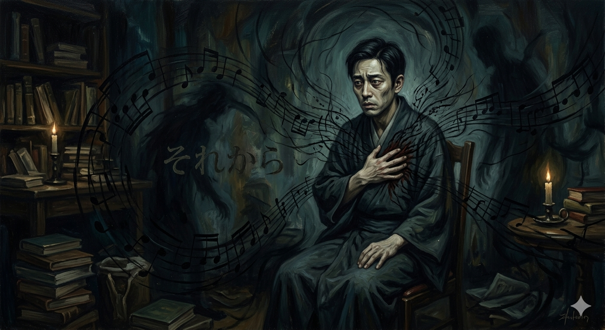

# And Then

In *And Then* (1909), Natsume Soseki projects the protagonist Daisuke’s dread of neurasthenia and heart disease onto the low, heavy rhythm at the opening of [the first movement of Schubert's Unfinished Symphony](https://www.youtube.com/watch?v=3tisvEpblig&list=RD3tisvEpblig&start_radio=1&t=1189s). The symphony's bass line—seemingly regular yet precariously uncertain as to when it might stop—auditorily amplifies the protagonist’s 'anxiety over a fading life.' A similar metaphorical approach can be found in [La Traviata](lee-jooseong.md), where the oboe melody mimics a patient's irregular heartbeat by depicting the rough, gasping breath of the dying. This psychological dread of death manifests clearly when Daisuke places his hand on his chest and feels his own heartbeat thumping "mournfully and terrifyingly, like a certain passage from Schubert's Unfinished Symphony." To him, this internal rhythm sounds like the "footsteps of fate" dragging him away somewhere, bringing upon him the terror that his life might vanish like a flickering flame in the wind. In particular, the background of the piece being 'unfinished' connects to the incomplete existence of a character who cannot lead a whole life due to a frail body. Through this, the author elevates the suffering of illness beyond mere physical distress into a fateful tragedy. In this regard, Natsume Soseki's use of musical devices to depict the character's bodily symptoms demonstrates a narrative medicine insight that does not merely define illness as biological data (Disease), but profoundly captures the character's subjective experience (Illness) through the non-verbal medium of music. At the same time, this serves as a literary breakthrough over 'physical pain,' which inherently resists being conveyed beyond the boundaries of language. By strategically placing Schubert's music at the very point where language struggles to describe, the author successfully portrays Daisuke's unspeakable physical dread and existential fractures.

# 그 후

『그 후』(1909)에서 나쓰메 소세키는 주인공 다이스케가 앓는 신경쇠약과 심장병에 대한 공포를 [슈베르트의 '미완성 교향곡' 1악장](https://www.youtube.com/watch?v=3tisvEpblig&list=RD3tisvEpblig&start_radio=1&t=1189s) 도입부의 낮고 무거운 리듬에 투영한다. 규칙적인 듯하면서도 언제 멈출지 몰라 위태로운 이 교향곡의 베이스 선율은 주인공이 느끼는 '사라져 가는 생명에 대한 불안'을 청각적으로 증폭시킨다. [라 트라비아타](lee-jooseong.md)에서도 비슷한 비유 방식으로, 오보에의 선율이 죽어가는 환자의 거칠고 가쁜 숨소리를 묘사하여 한 인물의 불규칙한 심장 박동을 흉내낸 것을 확인할 수 있다. 죽음에 대한 심리적 공포는 다이스케가 가슴에 손을 얹고 자신의 심장 박동이 "슈베르트의 미완성 교향곡의 어떤 한 대목처럼 애절하고도 무시무시하게 울리는 것"을 느낄 때 명확하게 드러난다. 그에게 이 내면의 리듬은 자신을 어디론가 끌고 가려는 "운명의 구두 소리"처럼 들리며, 마치 바람에 흔들리며 꺼져가는 불꽃처럼 자신의 생명이 사라져 버릴 것 같은 공포를 안겨준다. 특히 이 곡이 '미완성'이라는 배경은 허약한 신체 때문에 온전한 삶을 영위하지 못하는 인물의 불완전한 실존과 연결된다. 이를 통해 작가는 질병의 고통을 단순한 육체적 괴로움을 넘어선 숙명적인 비극으로 승화시킨다. 이처럼 나쓰메 소세키가 음악적 장치를 빌려 인물의 신체적 이상 징후를 묘사한 것은, 질병을 단순한 생물학적 데이터(Disease)로만 규정하지 않고 음악이라는 비언어적 매개체를 통해 인물이 겪는 주관적 경험(Illness)을 깊이 있게 담아낸 서사의학적 통찰을 보여준다. 동시에 이는 본질적으로 언어(글) 너머로는 전달하기 힘든 '육체적 고통'을 문학적으로 돌파한 사례이기도 하다. 작가는 언어가 묘사하기 힘든 바로 그 자리에 슈베르트의 음악을 배치함으로써, 말로 다 전할 수 없는 다이스케의 신체적 공포와 존재의 균열을 성공적으로 표현해 냈다.

# The Music I Hope to Have Played at My Funeral

[NO (SLOWED) BATIDÃO](https://www.youtube.com/watch?v=Bf2ml3oE2JA&list=RDBf2ml3oE2JA&start_radio=1)

Reason for Selection & Song Features:
It is said that at the end of life, human hearing remains until the very last moment to perceive acoustic changes, though the high-level ability to process the complex meaning of those sounds may fade away. Reflecting on this, I wanted a piece that serves not only as background music for those attending my funeral but also as the final sound 'I will listen to as I pass away.' Therefore, instead of a song with intricate messages or lyrics that require cognitive processing, I wanted something that could be understood intuitively and immediately by the senses. At the same time, I do not want my family and friends to bow their heads with gloomy faces at my final moment. Whether it is a memory of laughing together or a slight disagreement, I want them to shake it off as a pleasant memory and move forward with their own vibrant lives. For this reason, I chose a track with a powerful and addictive Brazilian Funk beat that can instantly shatter the heavy, solemn atmosphere of a funeral. Rather than dwelling on sadness, this music has the unique charm of energetically shifting the mood. Under this intense and intuitive sound, I hope everyone celebrates and sends me off with smiles rather than tears.

While selecting a funeral song in advance holds great meaning, the human mind is inherently in a constant state of flux. The music chosen in the past might not align with the true emotions one experiences when actually confronting death at the final moment. Just as current AI technologies recommend music based on photos or a user's expressed feelings, I came to think that these technologies could be innovatively applied to the extreme circumstances of life's final moments, where high-level verbal communication becomes impossible. If future advancements allow for the precise measurement of human brainwaves and neural signals to be integrated with real-time generative AI, it would become possible to reconstruct the dying patient's subjective emotions and real-time internal state into an unwarped melody. At the very threshold where language completely dissolves, could this not serve as a way for the dying to fully communicate with those gathered at the funeral, sharing their shifting emotions until the very end? Granted, there are concerns that music may overly romanticize a person's final moments. However, it might just be completely natural for a human being's very last moment to be warmly romanticized in such a way.

# 내 장례식에서 연주되길 희망하는 음악:

[NO (SLOWED) BATIDÃO](https://www.youtube.com/watch?v=Bf2ml3oE2JA&list=RDBf2ml3oE2JA&start_radio=1)

선정 이유 및 곡의 특징:
임종의 순간에 인간의 청각은 마지막까지 남아 소리의 변화를 인지하지만, 그 소리의 복잡한 의미까지 고차원적으로 이해하기는 어렵다고 한다. 이 점에 착안하여, 나는 내 장례식에 올 사람들에게 들려줄 음악으로서뿐만 아니라 '내가 죽어가는 과정에서 마지막으로 들을 음악'으로서의 의미도 고민했다. 그렇기에 복잡한 메시지나 가사를 분석해야 하는 노래 대신, 청각 세포에 직관적으로 와닿는 음악을 선택하고 싶었다. 동시에, 나의 마지막 순간에 가족이나 친구들이 침울한 표정으로 고개를 숙이고 있기를 바라지 않는다. 나와 함께 웃었던 기억이든, 혹시나 투닥거렸던 기억이든 모두 유쾌한 추억으로 털어내고 다시 각자의 활기찬 삶으로 나아가길 원한다. 그래서 장례식의 무거운 공기를 단번에 깨뜨릴 수 있는 강력하고 중독성 있는 브라질리언 펑크 비트의 곡을 선정했다. 이 음악은 슬픔을 억누르기보다 분위기를 에너제틱하게 환기해 주는 매력이 있다. 마지막 순간, 이 강렬하고 직관적인 사운드 속에서 사람들이 눈물 대신 웃음으로 나를 쿨하게 보내주었으면 한다.

이처럼 생전에 장례식 음악을 미리 선정해 두는 것도 의미가 있지만, 인간의 마음은 시시각각 변화한다. 과거에 선택한 음악이 막상 죽음을 마주한 실제 임종의 순간에는 본인이 진정으로 원하는 정서와 일치하지 않을 수 있는 것이다. 최근 AI가 사진에 어울리는 음악을 추천하거나 사용자가 감정을 토로하면 그에 맞는 음악을 추천하는데, 이러한 기술은 고차원적인 언어 소통이 불가능한 극한의 임종 순간에도 혁신적으로 활용될 수 있을 거란 생각이 들었다. 만약 미래에 인간의 뇌파와 신경 신호를 정밀하게 측정하는 기술이 실시간 음악 생성 AI와 결합한다면, 임종 직전 환자가 느끼는 주관적 감정과 실시간 내면 상태를 왜곡 없는 선율로 구현해 낼 수 있을 것이다. 이는 언어가 말 그대로 완전히 소멸한 자리에서, 죽어가는 이가 장례식에 모인 이들과 마지막으로 온전히 소통하고 시시각각 변화하는 자신의 정서를 공유하는 방법이 될 수 있지 않을까. 물론 음악이 한 인간의 마지막 순간을 지나치게 미화할 수 있다는 우려도 있다. 그러나, 한 인간의 마지막 순간 정도는 따뜻하게 미화되는 게 당연한 것일 수도 있다.
