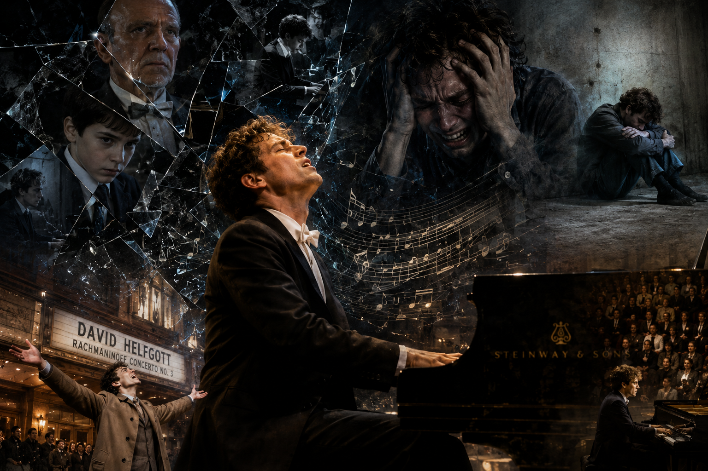

# shine

Director Scott Hicks’s film *Shine* (1996) is based on the true story of the real-life Australian pianist David Helfgott. The central piece of music used in the work is [the Piano Concerto No. 3 in D minor, Op. 30, composed by Sergei Rachmaninoff](https://youtu.be/8_p6-cAMr_g?si=caMXWQuv9-jW7-1z) (1 April 1873 – 28 March 1943), an instrumental concerto with no lyrics. David, a child prodigy raised under his father’s oppressive control, suffers a mental breakdown immediately after completing this piece at the Royal College of Music in England, and is diagnosed with schizophrenia and committed to a psychiatric hospital. The pressure of having to perfectly master this extraordinarily difficult concerto exceeded his mental limits and became the direct trigger for the onset of his schizophrenia, showing how music functions both as the cause of his collapse and, at the same time, as the medium of his recovery. The film’s main arc follows his journey of eventually returning to the concert stage through the power of music and love. For related artistic works, it would also be helpful to refer to [the content of other works of art](Yu-seungwon.md).

*Shine* connects deeply with several theoretical frameworks explored throughout the course. Viewed through Arthur Frank’s illness narrative typology (Week 3), David’s story resists the straightforward arc of a restitution narrative. The years of institutional isolation, social withdrawal, and the lasting imprint of a schizophrenia diagnosis place his journey closer to a quest narrative — one in which illness becomes the path through which he rediscovers who he is, and music becomes the vehicle for that search.
The film also resonates with Elaine Scarry’s argument on the inexpressibility of pain (Week 5). Rachmaninoff’s Third Concerto functions as the medium through which David externalizes an inner collapse that cannot be articulated in language. His suffering is communicated not through words but through the act of performance itself — the accelerating tempo, the violent force of each keystroke, the body pushed past its limits. This is precisely what Scarry describes: the moment pain is translated into language, its essential quality dissolves. The concerto makes that dissolution audible.
Finally, the concept of Auditory Anamnesis(Week 12) offers a compelling lens for this film. Listening to the Rach 3 alongside David’s story, we find ourselves attending to the music as though it were a clinical record — a sonic document of his psychological state. The concerto is not mere accompaniment; it is the only channel through which the audience can access his interior world. At the same time, William Cheng’s ethical provocation remains pressing: is it justifiable to consume another person’s suffering as art? The very act of recreating David Helfgott’s real-life breakdown on screen — dramatizing his disintegration for a viewing audience — demands that we reflect on the ethics of aestheticizing pain.

# 샤인

스콧 힉스(Scott Hicks) 감독의 영화 샤인(1996)은 실존 인물인 호주 피아니스트 데이비드 헬프갓(David Helfgott)의 실화를 바탕으로 한다. 작품에 사용된 핵심 음악은 세르게이 라흐마니노프(Sergei Rachmaninoff, 1873년 4월 1일~1943년 3월 28일)가 작곡한 [피아노 협주곡 3번 d단조 Op. 30(*Piano Concerto No. 3 in D minor, Op. 30*)](https://youtu.be/8_p6-cAMr_g?si=caMXWQuv9-jW7-1z)피아노 협주곡 3번 d단조 Op. 30(Piano Concerto No. 3 in D minor, Op. 30)으로, 가사 없는 기악 협주곡이다. 아버지의 억압적인 통제 아래 자란 천재 소년 데이비드는 영국 왕립음악원에서 이 곡을 완주한 직후 정신 붕괴를 경험하고, 조현병(schizophrenia) 진단을 받아 정신병원에 수용된다. 극도로 난해한 이 협주곡을 완벽히 소화해야 한다는 압박이 그의 정신적 한계를 초과하여 조현병 발병의 직접적 계기가 되었으며, 이는 음악이 붕괴의 원인이자 동시에 회복의 매체로 기능함을 보여준다. 훗날 음악과 사랑의 힘으로 연주 무대에 복귀하기까지의 여정이 영화의 줄기를 이룬다. 이와 관련된 예술 작품으로는 [다른 예술 작품의 내용](Yu-seungwon.md)도 참조하면 도움이 될 것이다.

영화 《샤인》은 수업에서 다룬 여러 이론적 틀과 긴밀하게 연결된다. 우선 아서 프랭크(Arthur Frank)의 질환서사 유형론(Week 3)에 비추어 보면, 데이비드의 서사는 단순한 ‘복원 서사’(restitution narrative)에 머물지 않는다. 정신병원에서의 긴 공백, 사회적 고립, 그리고 조현병이라는 진단이 그의 삶에 남긴 흔적은 완전한 회복보다는 ‘탐구 서사’(quest narrative)에 가깝다. 데이비드는 병을 통해 자신이 누구인지를 다시 발견하고, 음악은 그 탐구의 매개가 된다.
또한 수업에서 논의된 고통의 언어 불가능성(Elaine Scarry, Week 5)이라는 문제와도 연결된다. 라흐마니노프 피아노 협주곡 3번은 데이비드가 말로 표현할 수 없는 내면의 압박과 붕괴를 음악이라는 비언어적 형태로 드러내는 장치로 기능한다. 그의 고통은 대사가 아닌 연주 그 자체 — 가속되는 템포, 격렬한 타건, 신체적 한계에 도달한 손끝 — 로 전달된다. 이는 고통이 언어로 번역되는 순간 그 본질이 희석된다는 Scarry의 논지를 음악적으로 구현한 사례로 볼 수 있다.
나아가 ‘청각적 병력청취(Auditory Anamnesis)’ 개념(Week 12)도 이 영화를 이해하는 데 중요한 실마리를 제공한다. 우리는 라흐 3번을 들으며 데이비드의 정신 상태를 청진하듯 감지하게 된다. 음악은 단순한 배경이 아니라, 관객이 그의 내면에 접근할 수 있는 유일한 통로다. 동시에 윌리엄 청(William Cheng)이 제기한 윤리적 질문 — 타인의 고통을 예술로 소비하는 것이 정당한가 — 은 이 영화에서도 유효하다. 데이비드의 실제 삶을 스크린에 재현하고 그의 정신적 붕괴를 극적으로 연출하는 행위 자체가, 고통을 미학화하는 것에 대한 윤리적 성찰을 요구한다.

# Music I Hope Will Be Played at My Own Funeral

Death is often imagined in silence and shadow—but I want my farewell to be different. [BOOM BALA by LE SSERAFIM](https://www.youtube.com/watch?v=lep03GDhFqA) is a track defined by explosive energy and an unstoppable beat. Rather than asking those left behind to sit quietly with their grief, this music demands that emotion be expressed fully, loudly, and without apology.
A funeral is ultimately a space for the living. Instead of suppressing sorrow beneath formal decorum, I want the people I love to feel free to let it all out—cry, laugh, or simply stand there bewildered. Every reaction is, in its own way, a form of remembrance.
Like the title itself suggests—boom—I would rather be remembered as someone who went out with a bang than someone who faded quietly away.

# 자신의 장례식에서 연주되길 희망하는 음악

내가 장례식에서 흘렀으면 하는 곡은 [르세라핌의 BOOM BALA](https://www.youtube.com/watch?v=lep03GDhFqA)다.
죽음은 흔히 침묵과 어둠의 이미지로 표상되지만, 나는 내 마지막 자리를 다르게 만들고 싶다. BOOM BALA는 강렬한 비트와 폭발적인 에너지로, 억압된 감정을 밖으로 터뜨리는 음악이다. 슬픔을 조용히 삭이는 대신, 이 음악은 감정을 있는 그대로 크게, 뜨겁게 표출하도록 만든다.
장례식이란 남겨진 사람들을 위한 시간이다. 나는 그들이 격식과 체면 속에서 슬픔을 억누르는 대신, 이 음악처럼 온몸으로 감정을 내보낼 수 있기를 바란다. 울어도 좋고, 웃어도 좋고, 어이없어해도 좋다—그 모든 반응이 곧 나를 기억하는 방식이 된다.
BOOM BALA의 제목처럼, 나의 삶이 조용히 사그라드는 것이 아니라 쾅, 하고 터지듯 기억되었으면 한다.

# The connection between DB file and HYQ Porfolio

*Shine* illuminates the portfolio’s Future Question from two angles. First, the film frames Helfgott’s playing less as musicianship in itself than as an overcoming narrative that moves from paternal oppression through mental breakdown to a return enabled by music and love, thereby exemplifying the figure of the disabled musician consumed as an object of inspiration that this portfolio critiques. Second, because Rachmaninoff’s Third Concerto, the work he is required to master perfectly, is what triggers his collapse, the film reveals how an aesthetic standard of perfection and normativity pressures and excludes particular subjects through the same logic as the K-pop trainee selection system. At the same time, music operates as both the cause of his collapse and the medium of his recovery, which connects to the productive possibility of cracking open the standard articulated in section 2-3 of the portfolio.

# DB 파일과 HYQ Portfolio의 연결

샤인은 본 포트폴리오의 Future Question을 두 방향에서 조명하는 작품이다. 첫째, 영화는 헬프갓의 연주를 음악성 자체보다 아버지의 억압에서 정신적 붕괴를 거쳐 음악과 사랑을 통한 복귀에 이르는 극복 서사로 배치함으로써, 본 연구가 비판하는 ‘감동의 대상으로 소비되는 장애 뮤지션’의 전형을 드러낸다. 둘째, ‘완벽히 소화해야 할’ 라흐마니노프 협주곡 3번이 그의 붕괴를 촉발했다는 점에서, 미적 기준(완성도·정상성)이 특정 주체를 압박하고 배제하는 구조가 K-pop 연습생 선발 시스템과 동일한 논리로 나타난다. 동시에 음악은 붕괴의 원인이자 회복의 매체로 기능하며, 이는 본 포트폴리오 2-3에서 제시한 ‘미적 기준에 균열을 내는’ 긍정적 가능성과 연결된다.

