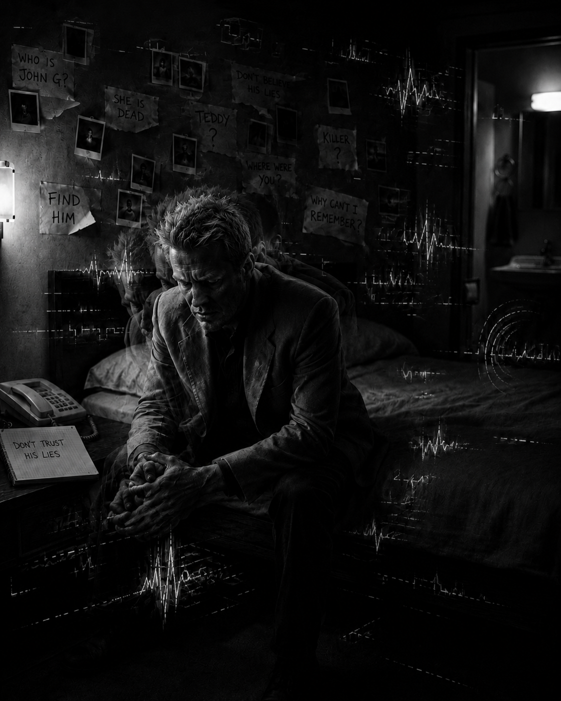

# Memento

*Memento* (2000), directed by Christoper Nolan,  is structured in a structure in which a black-and-white scene in a sequential manner and a color scene in a retrograde manner are intersected. Repetitive electronic sounds can be heard based on low and continuous orchestral sounds in a black-and-white scene. The electronic sound will make you sleep comfortably if you listen to it in a peaceful room. However, the electronic sound that is heard whenever the scene is converted to black and white in the movie makes the audience feel the tension, anxiety, and confusion that appear to Leonard as the memory does not last more than 10 minutes due to predisposing amnesia and is cut off. Therefore, this music is not just background music, but an important device that expresses Leonard's disability that cannot maintain a continuous sense of time and self-identity due to predisposing amnesia. In addition, the editing structure in which retrograde and sequential are intersected with sound recreates the disability of the protagonist in the work while making the audience feel confused. I think it would be good to refer to this article if you want to read another article in the situation of the character despite experiencing the same disease. [The cross-reference link to the article dealing with the same disease] (park-seoungrok.md )

While watching the movie, the audience is in an unstable state, relying on fragmentary information like Leonard rather than objectively understanding the event. This is not a way to observe the disability from the outside, but a way to bring it closer to the senses and pain of the disabled person. It is a medical and humanistic approach. This obstacle is not depicted only as an obstacle in the movie that hinders Leonard. It shows that the last Leonard in the movie can lose his memory and go back to another goal even after reaching the goal he has been looking for even though he does not remember. Leonard's disability is another reason for Leonard to continue his life, and it is also felt as a disability art of antecedent amnesia.

# My questions and thoughts related to the movie

During one semester, I learned about diseases and disabilities, and related music and sound. Among them, I noted that a sound can feel completely different depending on the situation and context.
This question became more concrete while watching the movie "Memento". You can also experience the electronic sound described above, the sound of the opponent's words that Leonard feels differently as he understands the opponent's intentions, and the sound of the glass breaking but evoking terrible memories for Leonard.
The memories and experiences of Leonard, the main character of the movie, change the meaning of the sound even more. Leonard, who has difficulty maintaining new memories for a long time, lives for revenge by holding on to the terrible memories of his wife's attack. Leonard achieves his goal, but Leonard, who has a disability, loses his memory again and the movie ends. What will happen to Leonard after this?

Leonard records in polaroid pictures that he has achieved his goal, but what he remembers for the rest of his life will be the last memory of his wife being attacked. For Leonard, the sounds at the time of the accident, which were traumatic, will feel different to Leonard. 
This perspective also leads to medical personnel's literature that does not look at diseases only with medical diagnosis and symptoms, but also tries to understand the emotions, memories, and daily experiences that patients actually experience. To understand Leonard's amnesia, one must not only look at what he cannot remember, but also think about how he experiences the sounds and situations around him. When a patient feels anxiety or pain at a specific sound, rather than simply judging it as a sensitive reaction, it is necessary to first look at the memory and meaning of the sound in the patient's life.
link: https://youtu.be/3AXJ2TMohn8?si=CzNQlIIB0r0LhxSn

# Music I hope to play at my funeral

The music I hope to be played at my funeral is Lee Jeok's "Running in the Sky". The reason is that this song feels free after completing one journey. The atmosphere of the song is not heavy, it has energy, and the lyrics also feel the will. The emotion of the song, which also stems from the title, is close to freedom, liberation, and new challenges. When this song resonates at the funeral, it is not as dark as it will create an atmosphere that celebrates my life, so I chose this song.

# 메멘토

메멘토에서 주인공 레너드는 앞선 기억이 10분마다 모두 사라지는 선행성 기억상실증을 앓고 있다. 영화는 순행으로 진행되는 흑백 장면과 역행으로 진행되는 컬러 장면이 교차하는 구성으로 짜여져 있다. 흑백의 장면에서 낮고 연속적으로 깔리는 관현악 소리를 바탕으로 반복적인 전자음 소리가 들린다. 전자음 소리는 평화로운 방 안에서 들으면 편안한 잠을 오게 할 것 같다. 하지만 영화 속에서 장면이 흑백으로 전환될 때 마다 들려오는 전자음 소리는  선행성 기억상실증에 의해 기억이 10분 이상 지속되지 못하고 끊어지면서 레너드에게 나타나는 긴장감과 불안감, 혼란스러움을 관객들로 하여금 느끼게 한다. 따라서 이 음악은 단순한 배경음악이 아니라, 선행성 기억상실증으로 인해 지속적인 시간 감각과 자기 정체성을 유지하지 못하는 레너드의 장애를 표현하는 중요한 장치라고 볼 수 있다. 또한, 역행과 순행이 교차되는 편집 구조는 사운드와 함께 관객들에게 혼란을 느끼게 하면서 작중 주인공의 장애를 재현한다. 같은 질병을 겪지만 등장인물이 처한 상황은 다른 글을 읽고싶다면 이 글을 참조하면 좋을 것 같다. [같은 질병을 다룬 글의 상호참조링크](park-seoungrok.md) 

영화를 보면서 관객은 사건을 객관적으로 이해하기보다 레너드처럼 단편적인 정보에 의존하며 불안정한 상태에 놓인다. 이는 장애를 외부에서 관찰하는 방식이 아니라, 장애를 가진 인물의 감각과 고통에 가까이 다가가게 하는 방식이다. 의료인문학적으로 접근을 하게 되는 것이다. 이 장애는 영화 속에서 레너드를 방해하는 장애물로만 그려지지 않는다. 영화의 마지막 레너드가 자신이 기억을 하지 못하면서도 그토록 찾아해메던 목표에 도달한 뒤에도, 기억을 잃으며 다시 또다른 목표를 향해 갈 수 있다는 암시를 보여준다. 레너드가 가진 장애는 레너드가 삶을 이어가게 되는 또다른 이유가 되기도 하기에 선행성 기억상실증의 장애예술로 느껴지기도 한다. 

# 영화와 연관된 나의 질문과 생각

한 학기 동안 질병과 장애, 그와 관련한 음악과 소리에 관해 배웠다. 그 중에서도 나는 하나의 소리가 상황과 맥락에 따라 전혀 다르게 느껴질 수 있다는 것에 주목했다. 
이 질문은 영화 《메멘토》를 감상하면서 더욱 구체화되었다. 위에서 설명한 전자음, 또 레너드가 상대의 의중을 파악하면서 달리 느껴지는 상대의 말소리, 단순히 유리가 깨지는 소리지만 레너드에겐 끔찍한 기억을 불러일으키는 것 등등 영화에서도 그 경험을 할 수 있다. 
영화의 주인공 레너드의 기억과 경험은 소리의 의미를 더욱 크게 변화시킨다. 새로운 기억을 장기간 유지하기 어려운 레너드는 아내가 습격당한 끔찍한 기억을 붙잡은 채 복수를 위해 살아간다. 레너드는 끝내 목표를 이룩하지만 장애를 가진 레너드는 다시 기억을 잃으며 영화는 끝이 난다. 레너드의 이후 삶은 어떠할까? 

레너드는 목표를 이뤘다는 것을 폴라로이드 사진으로 기록하지만 여생을 살아가는 동안 기억하는 것은 오직 아내가 습격당한 마지막 기억일 것이다. 레너드에게는 트라우마가 된 사고 당시의 소리들은 레너드에게만 다르게 느껴질 것이다. 
이러한 관점은 질병을 의학적인 진단과 증상만으로 바라보지 않고 환자가 실제로 겪는 감정과 기억, 일상의 경험까지 함께 이해하려는 의료인문학과도 이어진다. 레너드의 기억상실증을 이해하기 위해서는 그가 무엇을 기억하지 못하는지만 살펴보는 것이 아니라 주변의 소리와 상황을 어떻게 경험하며 살아가는지도 생각해야 한다. 환자가 특정한 소리에 불안이나 고통을 느낄 때 이를 단순히 예민한 반응으로 판단하기보다 그 소리가 환자의 삶에서 어떤 기억과 의미를 가지는지 먼저 살펴보아야 한다.
link: https://youtu.be/3AXJ2TMohn8?si=CzNQlIIB0r0LhxSn

# 나의 장례식에서 연주되길 희망하는 음악

내 장례식에서 연주되길 희망하는 음악은 이적의 〈하늘을 달리다〉이다. 그 이유는 이 노래가 하나의 여정을 끝마치고 자유로움을 느끼는 것처럼 느껴졌기 때문이다. 곡의 분위기가 무겁지 않고 에너지가 있으며 가사 또한 의지가 느껴진다. 제목에서도 비롯되는 노래의 정서는 자유, 해방감, 새로운 도전에 가깝다. 이 곡이 장례식에서 울려퍼졌을 때 마냥 어둡지 않고 내 삶을 기념하는 분위기를 만들어줄 것 같아 이 곡을 선택했다.
