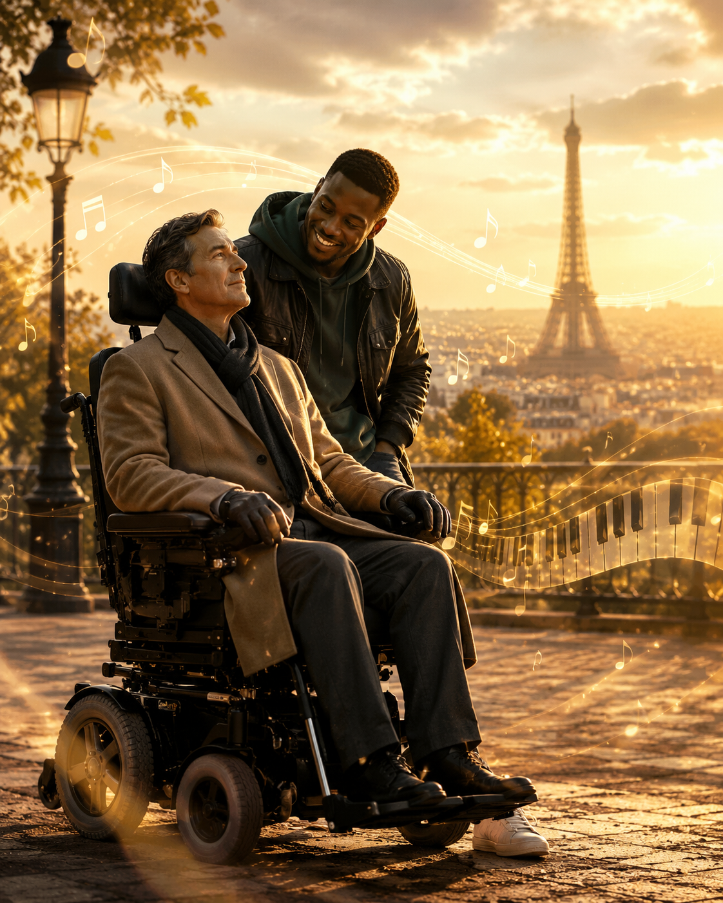

# The Untouchable

 The film *The Intouchables* portrays the story of Philippe, a millionaire who becomes paralyzed from the neck down after an accident, and Driss, a young man from a poor neighborhood, as they meet and gradually change each other’s lives. Philippe has great wealth and knowledge, but after losing his physical freedom, he has to depend on others for almost every moment of his daily life. However, the film does not portray Philippe’s disability simply as a deficiency that must be overcome. Rather, the film focuses less on the disability itself and more on the way people around him look at a person with a disability. The people around Philippe treat him carefully and try to protect him, but this attitude sometimes fixes him as an object of care rather than as a person with his own identity. In contrast, Driss does not overly pity Philippe. At first, he treats Philippe rather roughly, but after they become closer, he jokes with him, drives fast cars with him, and listens to music with him, which deepens their relationship. Although Driss first attends the interview only as a formal job-seeking activity to receive unemployment benefits, Philippe discovers in Driss’s attitude a gaze that treats him not merely as a “disabled person,” but as someone who still has emotions and tastes. Later, the two move beyond the relationship of employer and employee and become friends. Driss assists Philippe in his daily life, but he does not try to change Philippe according to the standards of a non-disabled body. Instead, he shows how Philippe, with his current body, can laugh again and build relationships with others. In this sense, the film moves away from the idea that disability is simply a problem that must return to a “normal” state. What Philippe needs is not only the recovery of physical function, but also the sense that he can still experience life with his present body and senses. Later, Driss arranges a dinner meeting between Philippe and the woman he has developed feelings for through letters, and the film comes to an end. In this work, Ludovico Einaudi’s piano piece [*Una Mattina*](https://youtu.be/94-PAIMDhaQ?si=pFhxLnUtNbvOedTA) is used as important music that expresses Philippe’s inner world. The film also includes popular music that shows Driss’s lively personality, but *Una Mattina* is different because it suits moments when the character’s emotions quietly deepen. The piano melody, repeated at a steady tempo, reminds the audience of Philippe’s physically still body, which cannot move freely. However, the same melody does not simply remain still. It gradually changes, and other notes are layered over it, suggesting that Philippe’s inner life is still alive and moving.In particular, this music allows the audience to look again at Philippe’s loneliness and wounds. Although Philippe is not physically free, the music shows that his emotions are still flowing. Especially after meeting Driss, Philippe’s life does not suddenly change completely. Rather, small sensations slowly come back to life. The repetitive yet gradually expanding structure of [*Una Mattina*](https://youtu.be/94-PAIMDhaQ?si=pFhxLnUtNbvOedTA) resembles this process of change. Therefore, this piece does not emphasize Philippe’s disability only as sadness. Instead, it can be seen as an auditory expression of emotional movement and the possibility of life that continue even within a limited body.

# 언터처블: 1%의 우정

 영화 *언터처블: 1%의 우정*은 사고로 전신마비가 된 백만장자 필립과, 빈민가 출신 청년 드리스가 만나 서로의 삶을 변화시켜 가는 과정을 그린 작품이다. 필립은 막대한 부와 지식을 지녔지만, 신체적 자유를 잃은 뒤 일상의 거의 모든 순간을 타인의 도움에 의존하며 살아간다. 그러나 영화는 필립의 장애를 단순히 극복해야 할 결핍으로만 그리지 않는다. 오히려 작품이 주목하는 것은 장애 자체보다는, 장애를 가진 사람을 바라보는 주변의 시선이다. 필립의 주변 사람들은 그를 조심스럽게 대하고 보호하려 하지만, 그 태도는 때로 필립을 한 사람의 인격체라기보다 돌봄의 대상으로만 고정시킨다. 반면 드리스는 필립을 지나치게 동정하지 않았다. 그는 필립에게 처음에 막 대하는 장면이 나왔고, 친래진 이후에는 농담치고 빠른 차를 타고 달리며, 음악을 함께 들으면서 사이가 더욱 가까워지게 되었다. 처음에는 실업급여를 받기 위한 형식적인 구직 활동으로 면접에 참여했을 뿐이지만, 필립은 드리스의 태도에서 자신을 ‘장애인’이 아니라 여전히 감정 및 취향을 가진 비장애인으로 대하는 시선을 발견한다. 이후 두 사람은 고용인과 고용주의 관계를 넘어 친구가 된다. 드리스는 필립의 생활을 보조하지만, 필립을 비장애인의 기준에 맞춰 바꾸려 하지는 않는다. 오히려 지금의 몸을 가진 필립이 어떻게 다시 웃으면서 타인과 관계 맺을 수 있는지를 보여 준다. 이 점에서 영화는 장애를 정상적인 상태로 돌아가야 하는 문제로만 바라보는 태도에서 벗어난다. 필립에게 필요한 것은 단순히 신체 기능의 회복만이 아니라, 자신의 현재 몸과 감각을 가진 채로도 삶을 경험할 수 있다는 감각이다. 이후에 드리스는 필립이 편지로만 주고받으면서 호감을 가진 여성과 식사 자리를 마련해주면서 영화는 끝이 난다. 이 작품에서 루도비코 에이나우디의 피아노곡 [*Una Mattina*](https://youtu.be/94-PAIMDhaQ?si=pFhxLnUtNbvOedTA) 필립의 내면을 표현하는 중요한 음악으로 사용된다. 영화에는 드리스의 활기찬 성격을 보여 주는 대중음악도 등장하지만, Una Mattina는 그와 달리 인물의 감정이 조용히 깊어지는 순간에 어울린다. 일정한 템포로 반복되는 피아노 선율은 겉으로는 움직일 수 없는 필립의 정지된 몸을 떠올리게 한다. 그러나 같은 선율이 단순히 멈춰 있는 것이 아니라 조금씩 변주되고, 그 위에 다른 음들이 겹쳐지면서 필립의 내면은 여전히 살아 움직이고 있음을 들려준다. 특히 이 음악은 필립의 고독과 상처를 다시 바라보게 만드는 역할을 한다. 필립은 육체적으로 자유롭지 못하지만, 음악은 그의 감정이 여전히 흐르고 있다는 사실을 보여 준다. 특히 드리스와의 만남 이후 필립의 삶은 갑자기 완전히 달라지는 것이 아니라, 작은 감각들이 서서히 되살아나는 방식으로 변화한다. [*Una Mattina*](https://youtu.be/94-PAIMDhaQ?si=pFhxLnUtNbvOedTA)의 반복적이면서도 점진적으로 확장되는 구조는 바로 그 변화를 닮아 있다. 그래서 이 곡은 필립의 장애를 슬픔으로만 강조하기보다, 제한된 몸 안에서도 계속되는 감정의 움직임과 삶의 가능성을 청각적으로 표현한다고 볼 수 있다.

# A Song I Would Like to Be Played at My Funeral

 At my funeral, I would like Ludovico Einaudi’s [Nuvole Bianche](https://youtu.be/4VR-6AS0-l4?si=j3LvIR0_mLCJdJUn)to be played. This piece does not force excessive sadness, but it quietly allows people to look back on one person’s life. As we learned in Week 2, sound does not simply exist by itself; it gains meaning when it is perceived by someone. Therefore, at a funeral, this music would not be only for me as the person leaving, but also a sound through which the people who remain can remember me and accept farewell in their own ways. Also, as we learned in Week 3 about the intersection of medical humanities and art, I think death is not merely a biological end, but an event that gains meaning again through the memories and emotions of those who remain. Connecting this to the Week 5 question, “Can pain be expressed through music?”, this piece expresses both loss and comfort without directly explaining sadness in words. The repeated piano melody reminds people of the time that continued even though life was not perfect, and the calmly layered sounds allow those who remain to slowly look back on my life through their own memories. Rather than music that cries out loudly, I think music that stays calm would express the time I lived more truthfully. I hope the people who come to my funeral remember the moments we shared, rather than remembering me with pity. Like the title, “white clouds,” I hope the final moment feels not only like a heavy farewell, but like a slow and gentle parting. As the Week 14 phrase “Life is short, art is long” suggests, human life eventually comes to an end, but music can remain longer in the memories of those who are left behind. Therefore, I think this piece could be music that decorates the end of my life, while also becoming music of comfort for those who remain.
# 나의 장례식에서 나오면 좋을 노래

 내 장례식에서는 루도비코 에이나우디의 [Nuvole Bianche](https://youtu.be/4VR-6AS0-l4?si=j3LvIR0_mLCJdJUn)가 흘러나오면 좋겠다. 이 곡은 지나치게 슬픔을 강요하지 않으면서도, 조용히 한 사람의 삶을 돌아보게 만든다. 2주차에 배운 것처럼 소리는 단순히 그 자체로 존재하는 것이 아니라 누군가에게 지각될 때 의미를 얻는다고 생각한다. 그렇기 때문에 장례식에서 이 음악은 떠나는 나만을 위한 음악이 아니라, 남아 있는 사람들이 나를 기억하고 각자의 방식으로 이별을 받아들이게 하는 소리가 될 수 있다. 또한 3주차에 배운 의료인문학과 예술의 접점처럼, 죽음도 단순한 생물학적 끝이 아니라 남은 사람들의 기억과 감정 속에서 다시 의미를 얻는 사건이라고 생각한다. 5주차의 “고통은 음악으로 표현될 수 있는가”라는 질문과 연결해 보면, 이 곡은 슬픔을 직접 말로 설명하지 않으면서도 상실감과 위로를 동시에 표현한다. 반복되는 피아노 선율은 삶이 완벽하지 않아도 계속 이어졌던 시간들을 떠올리게 하고, 차분히 쌓이는 음들은 남은 사람들이 각자의 기억 속에서 나의 삶을 천천히 되돌아보게 만든다. 빠르게 울부짖는 음악보다, 차분히 머무르는 음악이 내가 살았던 시간을 더 진실하게 표현해 줄 것 같다. 장례식에 온 사람들이 나를 불쌍하게 기억하기보다, 함께했던 순간들을 조용히 떠올렸으면 한다. 흰 구름이라는 제목처럼, 마지막 순간이 무겁기만 한 이별이 아니라 천천히 흘러가는 작별로 느껴졌으면 좋겠다. 14주차의 “인생은 짧고 예술은 길다”라는 말처럼, 인간의 삶은 언젠가 끝나지만 음악은 남은 사람들의 기억 속에서 더 오래 머무를 수 있다. 그래서 이 곡은 나의 끝을 장식하는 음악이면서도, 남은 사람들에게는 위로의 음악이 될 수 있다고 생각한다.
